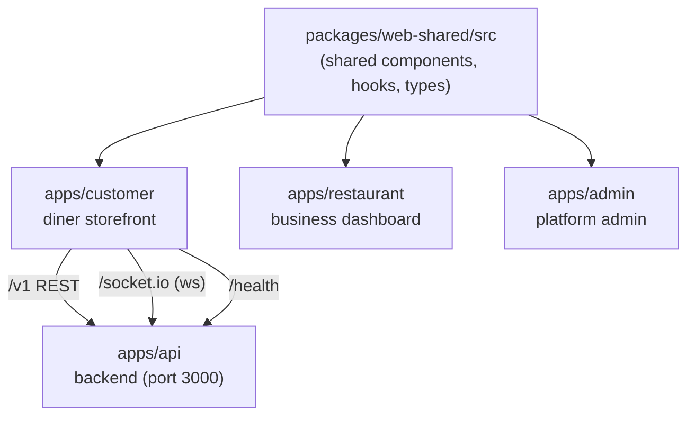
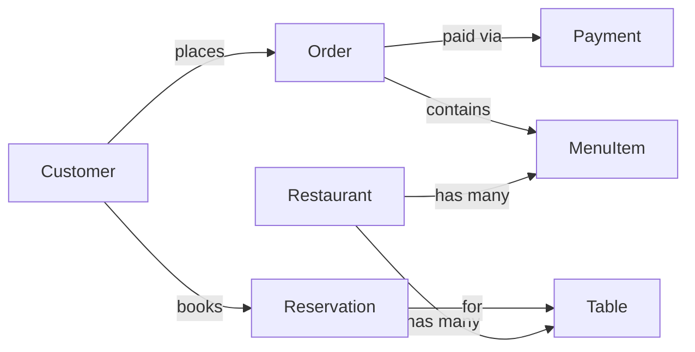

# ontime.ge Customer App — Technical Design Document

2026-09-20 · @Someone

This document describes the customer-facing storefront app (`@ontime/customer`) in the ontime.ge platform, **inferred from its build configuration and product tagline** — the actual page/component source (`src/`) was not available, so feature and data-model details are best-effort inferences, clearly flagged below, not confirmed facts.

## Overview & Purpose

**ontime.ge** is a restaurant discovery, ordering and reservation platform. The customer app (`@ontime/customer`) is its diner-facing storefront, confirmed by two source facts:

- `package.json` description: "ontime.ge — the diner storefront (discovery, ordering, reservations)"
- `index.html` meta description: "Find a table, order ahead for pickup or dine-in, and walk straight to a seat that's ready."

The page title ("find the table, skip the wait") and the theme reinforce the core value proposition: **reduce the wait between deciding to eat somewhere and being served** — whether that means booking a table ahead, or placing an order for pickup/dine-in before arriving.

Brand details confirmed from `index.html`: dark theme color (`#211714`), display font Archivo (weights 600–900), body font Plus Jakarta Sans, monospace accent IBM Plex Mono (likely for prices, order numbers, or timers).

## Scope & Assumptions

**What this TDD is based on:** the customer app's root config only — `package.json`, `index.html`, `vite.config.ts`, `tsconfig*.json`, `eslint.config.js`. No `src/` folder (pages, components, routes, API client) and no live URL were available.

**What that means:**

| Section | Confidence |
| --- | --- |
| Architecture (monorepo shape, dev proxy, ports) | Confirmed — read directly from config |
| Tech stack | Confirmed — read directly from `package.json` |
| Features, screens, user flows | **Inferred** — reasoned from the tagline + which libraries are installed |
| Data model | **Inferred** — plausible entities implied by the feature set, not seen in code |
| API contract (endpoints, payload shapes) | **Not available** — only that `/v1`, `/health`, and `/socket.io` exist as paths |

Every inferred section below is written as a starting draft for your team to correct, not a spec to build against as-is. Treat anything under "Inferred" as a hypothesis until checked against the real `src/` tree, the `apps/api` service, or a running instance.

## System Architecture

Confirmed from `vite.config.ts` comments and alias/proxy setup — this is a **monorepo** with (at least) four projects:

**Why it's built this way:** a `@shared` alias resolves to `../../../packages/web-shared/src`, outside the customer app's own root — the config comment notes this is deliberate so "one fix lands in all three \[apps\], nothing to duplicate." The dev server proxies `/v1`, `/health` and `/socket.io` to `apps/api`, meaning the customer app itself holds no backend logic — it's a pure client consuming a shared API.

**Restaurant and admin apps** are named directly in the shared-alias comment but their own configs weren't provided, so their scope (dashboard for restaurant owners, internal ops tooling for admins — typical for this kind of marketplace) is a reasonable but unconfirmed guess.

## Tech Stack

| Dependency | Role in the app |
| --- | --- |
| React 19 + React DOM | UI rendering |
| Vite 6 + `@vitejs/plugin-react` | Dev server & build tool |
| TypeScript 6 (project references) | Type safety, split `tsconfig.app.json` / `tsconfig.node.json` |
| Tailwind CSS 4 (`@tailwindcss/vite`) | Styling |
| React Router 7 | Client-side routing |
| TanStack Query 5 (+ devtools) | Server-state fetching/caching against `/v1` |
| Zustand 5 | Local/UI client state |
| React Hook Form 7 + Zod 4 + `@hookform/resolvers` | Form state & schema validation (e.g. checkout, reservation forms) |
| Stripe (`@stripe/stripe-js`, `@stripe/react-stripe-js`) | Payment collection for orders |
| Leaflet + `@types/leaflet` | Interactive maps, likely restaurant discovery/location |
| Socket.IO client | Real-time updates (e.g. order status, table availability) |
| date-fns + date-fns-tz | Date/time formatting across timezones (reservation slots, order timing) |
| clsx | Conditional className composition |
| lucide-react | Icon set |
| ESLint 9 + typescript-eslint + React plugins | Linting |
| Vitest 4 + Testing Library + jsdom | Unit/component testing, with a `VITE_USE_MOCKS=true` in-browser mock mode for tests |

No state-management or data layer beyond TanStack Query + Zustand was found — there's no Redux, no GraphQL client, so the API is presumably a conventional REST/JSON service.

## Inferred Feature Set (Core Screens)

Everything in this section is **inferred** from the tagline ("find a table, order ahead for pickup or dine-in, walk straight to a seat that's ready") plus which libraries are installed — none of it was read from actual page code.

1. **Discovery** — browse/search restaurants, likely a Leaflet map view plus list view, with filters (cuisine, distance, open now). *Signal: Leaflet + Query.*
2. **Restaurant detail** — menu, hours, location, table availability. *Signal: needed to support both ordering and reservations.*
3. **Reservations** — pick a time slot and party size, book a table ahead. *Signal: date-fns-tz (timezone-aware slots), React Hook Form + Zod for the booking form.*
4. **Order-ahead (pickup or dine-in)** — build a cart from the menu, choose pickup or dine-in, pay in-app. *Signal: Stripe libraries, explicitly named in the tagline.*
5. **Checkout / payment** — Stripe Elements-based payment form. *Signal: `@stripe/react-stripe-js`.*
6. **Live order/table status** — "walk straight to a seat that's ready" implies a real-time notification when a table or order is ready. *Signal: socket.io-client.*
7. **Account / order history** — some form of customer identity to track past orders and reservations is implied by having a checkout at all, though no auth library (e.g. no `@auth0`, no NextAuth-equivalent) was found — auth may be handled by the shared package or a custom flow in `apps/api`.

**Not inferable from what's available:** exact navigation structure, whether there's a native mobile app, loyalty/rewards, review or rating features, or multi-restaurant cart support.

## Inferred Data Model

Plausible entities implied by the feature set above — **none of these field lists come from real schemas or API responses**, they're a starting hypothesis for your team to correct against the actual `apps/api` models.

| Entity | Likely key fields |
| --- | --- |
| Customer | id, name, email/phone, saved payment method (Stripe customer id) |
| Restaurant | id, name, location (lat/lng for Leaflet), cuisine, hours, status |
| Table | id, restaurantId, capacity, current status (free / reserved / occupied) |
| MenuItem | id, restaurantId, name, price, category, availability |
| Order | id, customerId, restaurantId, items, fulfillment type (pickup/dine-in), status, paymentId |
| Reservation | id, customerId, restaurantId, tableId, partySize, time slot (tz-aware), status |
| Payment | id, orderId, Stripe payment intent id, amount, status |

Status fields on Order/Table/Reservation are what the socket.io real-time layer most likely pushes updates for (e.g. "table ready", "order ready for pickup").

## API & Real-Time Design

Confirmed from the dev proxy block in `vite.config.ts`:

| Path | Purpose |
| --- | --- |
| `/v1/*` | Versioned REST API — proxied to `apps/api`, default `http://127.0.0.1:3000` locally |
| `/health` | Health check endpoint |
| `/socket.io/*` | WebSocket channel (Socket.IO), `ws: true` in the proxy — real-time push |

The API target is overridable via `API_PROXY_TARGET`, so staging/production point the customer app at a different host without a code change. No endpoint list, request/response shapes, or auth scheme were available — those live in `apps/api`, which wasn't provided.

**Note on IPv4:** the config comment specifically pins the fallback target to `127.0.0.1` rather than `localhost`, because the API binds IPv4-only and some environments resolve `localhost` to IPv6 first, causing `ECONNREFUSED`. Worth keeping if this app is ever containerized differently.

## Build, Quality & Deployment Notes

Confirmed from config:

- **Vendor chunking:** the Rollup build manually splits `vendor-react`, `vendor-router`, `vendor-data` (TanStack + Zustand), `vendor-zod`, and `vendor-date` into stable chunks — the stated goal is that redeploying the app doesn't bust the browser cache for the (larger, slower-changing) framework code.
- **TypeScript:** project-reference split across `tsconfig.json` (root), `tsconfig.app.json`, `tsconfig.node.json` — standard Vite pattern separating app code from Node-side config typing.
- **Testing:** Vitest with jsdom, global test APIs, a shared setup file from `packages/web-shared/src/test/setup.ts`. Both this app's tests and the shared package's tests run together. Tests always force `VITE_USE_MOCKS=true`, so unit/component tests never hit a real API regardless of local `.env` settings.
- **Linting:** ESLint 9 flat config with TypeScript-ESLint and React Hooks/Refresh plugins.
- **Dev server:** port 5173 by default, overridable via `PORT` env var; Vite's `fs.allow` is widened to the monorepo root so it can serve the `@shared` path outside the app's own directory.

Not available: CI/CD pipeline, hosting target (Vercel/Netlify/custom), environment variable list beyond `API_PROXY_TARGET` and `PORT`, or a Dockerfile.

## Open Questions & Risks

- [ ] Confirm the real navigation/route structure against `src/` (this doc guesses at 7 screens from the tagline alone)
- [ ] Confirm data model field names/types against `apps/api`'s actual schema or OpenAPI spec, if one exists
- [ ] Confirm auth approach — no auth library appeared in `package.json`; is it session-cookie based, handled entirely server-side, or in `web-shared`?
- [ ] Confirm what the Socket.IO channel actually emits (event names/payloads) — this doc assumes order/table status only
- [ ] Get the `restaurant` and `admin` app configs to confirm their scope, since they were only inferred from a code comment
- [ ] Get deployment/CI details before using this as a basis for infra planning

This document should be treated as a **discussion draft** to compare against the real codebase, not as an as-built spec.
